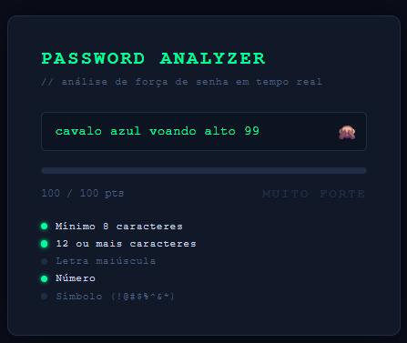

# 🔐 Password Strength Analyzer

Cybersecurity-focused password analysis platform powered by Flask and zxcvbn.


## 📸 Dashboard Preview



---

## 📖 About The Project

Password Strength Analyzer is a cybersecurity laboratory project developed to evaluate password security in real time.

The application uses Dropbox's zxcvbn engine, one of the most widely recognized password strength estimation libraries, to provide realistic security analysis instead of simple length-based validation.

Users receive instant feedback regarding password complexity, estimated cracking time, security score, and recommendations for improving password resilience.

> ⚠️ Educational and portfolio project developed for cybersecurity learning purposes.

---

## 🚀 Features

✅ Real-time password analysis

✅ zxcvbn security engine integration

✅ Password strength scoring

✅ Estimated password cracking time

✅ Uppercase letter validation

✅ Number validation

✅ Special character validation

✅ Password length verification

✅ Dynamic progress bar

✅ Security recommendations

✅ Instant feedback system

---

## 🚀 Key Improvements

- Migrated from basic rule-based validation to Dropbox's zxcvbn engine
- Added realistic password strength estimation
- Added password cracking time calculation
- Added security recommendations generated by zxcvbn
- Improved password scoring accuracy
- Enhanced cybersecurity learning value

---

## 🧪 Example Analysis

Password:

```text
N1k0l@$fSecurity2026
```

Results:

```text
Score: 100/100
Strength: Very Strong
Estimated Crack Time: Centuries
```

---

## 🛠️ Technologies

- Python
- Flask
- zxcvbn
- HTML5
- CSS3
- JavaScript

---

## 📂 Project Structure

```text
password-strength-analyzer/
│
├── app.py
├── requirements.txt
├── password-analyzer-preview.png
│
└── templates/
    └── index.html
```

---

## ⚙️ Installation

Clone the repository:

```bash
git clone https://github.com/nikolas-reges/password-strength-analyzer.git
```

Enter the project folder:

```bash
cd password-strength-analyzer
```

Create a virtual environment:

```bash
python -m venv venv
```

Activate the virtual environment:

Windows:

```bash
venv\Scripts\activate
```

Linux:

```bash
source venv/bin/activate
```

Install dependencies:

```bash
pip install -r requirements.txt
```

Run the application:

```bash
python app.py
```

Application available at:

```text
http://127.0.0.1:5002
```

---

## 🎯 Learning Objectives

This project was developed to practice:

- Cybersecurity Fundamentals
- Password Security
- Risk Assessment
- Python Development
- Flask Web Applications
- Front-End and Back-End Integration
- Security Awareness
- Secure Authentication Concepts

---

## 👨‍💻 Author

Nikolas Reges

Cybersecurity student focused on Blue Team, Security Monitoring and Defensive Security.
